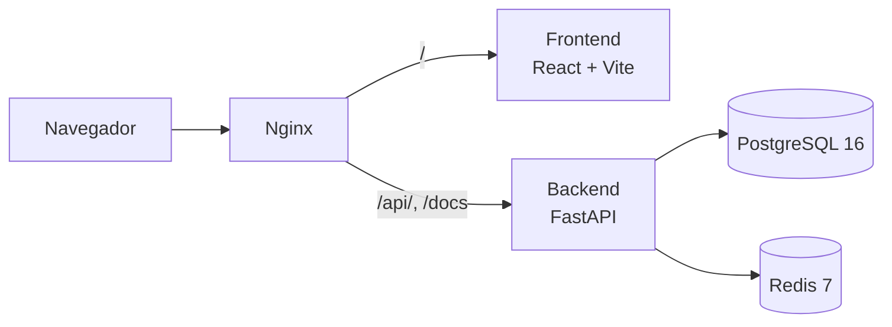

# 🤰 MaternityAI

Monorepo de **Guía Materna Inteligente (GMI)**: una plataforma de seguimiento materno-perinatal con asistente de IA, desplegable con un solo `docker compose up`.

---

## 📋 Propósito

MaternityAI acompaña el embarazo desde el registro de la gestante hasta el parto y el puerperio, centralizando la información clínica y poniéndola al alcance tanto de la gestante como del equipo de salud.

La API está organizada en módulos funcionales:

| Módulo | Alcance |
| --- | --- |
| `m0` | Registro y perfil de la gestante |
| `clinical` | Seguimiento clínico, controles y exámenes |
| `m4` | Parto y puerperio |
| `m5` | Educación y autocuidado |
| `m6` | Comunicaciones y alertas |
| `ia` | Asistente de IA sobre OpenAI |
| `admin` | Administración y carga masiva de datos |

Otras capacidades destacadas:

- 👥 **Cuatro perfiles de usuario** con vistas propias: gestante, clínico, administrador y hospital.
- 📊 **Carga masiva por Excel** para altas y actualizaciones desde el panel de administración 
- 📱 **PWA instalable**, con caché offline de la API y de las imágenes.


---

## 🏗️ Arquitectura



---

## 🧰 Tecnologías

| Capa | Stack |
| --- | --- |
| Frontend | React 19 · TypeScript 5.8 · Vite 7 · React Router 7 · Axios · `vite-plugin-pwa` · pnpm 10 · Node 20 |
| Backend | Python 3.12 · FastAPI 0.115 · SQLAlchemy 2.0 + SQLModel · Alembic · Pydantic v2 · JWT (python-jose) · OpenAI SDK |
| Datos | PostgreSQL 16 (asyncpg) · Redis 7 |
| Infraestructura | Docker Compose · Nginx 1.27 como reverse proxy |

---

## 📁 Estructura del monorepo

```text
.
├── MaternityAi-Web/     # SPA React + Vite (PWA) 
├── gmi-backend/         # API FastAPI + Alembic  
├── deploy/nginx/        # Configuración del reverse proxy
├── docker-compose.yml   # Orquestación del stack completo
└── .env.example         # Plantilla de variables de entorno
```

---

## 🚀 Inicio rápido

Requisitos: Docker y Docker Compose.

```bash
cp .env.example .env    
docker compose up -d --build
docker compose ps
```

---

## ⚙️ Variables de entorno

| Variable | Descripción |
| --- | --- |
| `APP_PORT` | Puerto HTTP publicado por Nginx (por defecto `8082`) |
| `PUBLIC_API_URL` | URL pública **sin barra final**; se usa como base del frontend y como `CORS_ORIGINS` |
| `POSTGRES_USER` / `POSTGRES_DB` | Usuario y base de datos de PostgreSQL |
| `POSTGRES_PASSWORD` | Contraseña de PostgreSQL **obligatoria** |
| `JWT_SECRET_KEY` | Clave de firma de los tokens JWT **obligatoria** |
| `OPENAI_API_KEY` | Clave del asistente de IA **obligatoria** |
| `JWT_ACCESS_TOKEN_EXPIRE_MINUTES` / `JWT_REFRESH_TOKEN_EXPIRE_DAYS` | Vigencia de los tokens (`30` / `7` por defecto) |

Sin las tres variables obligatorias el stack no arranca.

---

## 📚 Más documentación

- [DEPLOYMENT.md](DEPLOYMENT.md): despliegue completo con Docker Compose.
- [MaternityAi-Web/README.md](MaternityAi-Web/README.md): desarrollo local del frontend, scripts y rutas por rol.
- [gmi-backend/README.md](gmi-backend/README.md): instalación y ejecución local de la API.